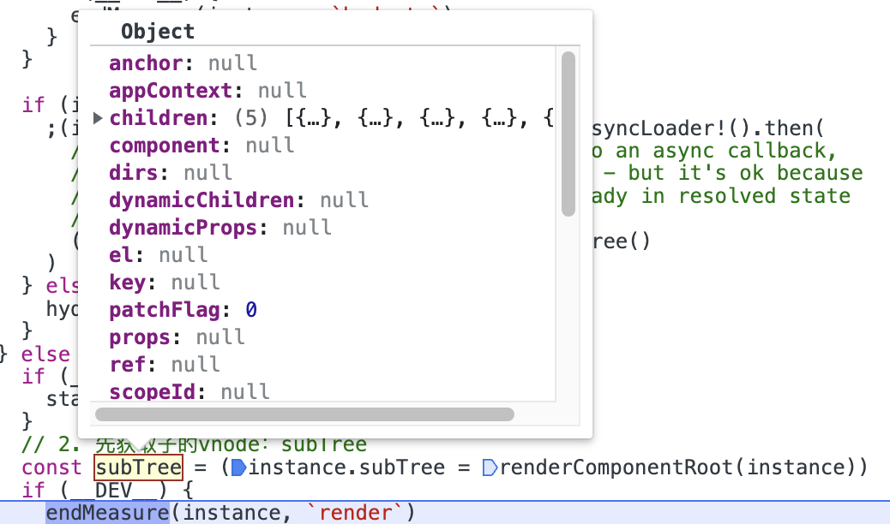
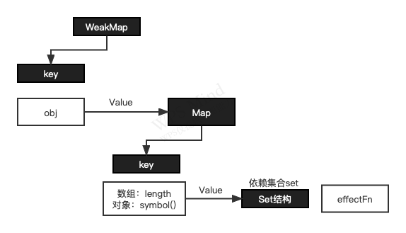

# vue

### createApp初始化

1. 为了跨平台做准备，vue3在针对不同的平台传入不同的options，构建出符合这个平台的**渲染器ensureRender**

2. 渲染器中后返回一个`createApp：createAppAPI（）`方法，这个方法就是创建app实例的地方

3. createAppAPI方法里面才是创建app这个对象的地方，里面大概有7个app实例上的方法，`use,mixin,component,directive,mount,unmount,provide`

4. app在外面重写了mount方法，里面又掉了之前在app里面的mount方法，mount方法里面做了这些事情

   - 拿到容器container
   - 拿到根组件
   - 先清除挂载点上之前的内容
   - 调用mount()方法：里面做了两件事：**创建vnode,渲染vnode为真实dom**

5. Mount()方法中做的事情：

   1. createVNode()方法用来创建虚拟节点：主要就是构造出一个vnode对象
   2. render()用来渲染vnode，它里面就会调用`patch()`方法

6. patch()方法中做的事情很多

   - 根据传入节点的类型通过switch处理走不同的processXXX逻辑，如我们这里的根组件，那么就会走`processComponent`
   - `processComponent`分为挂载和更新

7. `mountComponent`挂载组件

   1. 创建组件实例`createComponentInstance`

   2. `setupComponent`中初始化组件内容`initProps`和`initSlots`，将props,slots等属性绑定到组件实例上

      - 有setup函数
        1. createSetupContext创建setup上下文
        2. 执行setup函数，根据setupResult做不同的操作
           1. 如果是promise，则`setupResult.then()`
           2. 判断返回的是函数还是对象
              - 如果是函数：会作为render函数返回
              - 如果是对象：则做一层proxy代理，instance.setupState = proxyRefs(setupResult)
              - 最后，还是会调用`finishComponentSetup`函数

      - 没有setup函数,执行`finishComponentSetup`
      - finishComponentSetup()：这个函数里面会判断是否有模板或者render函数，两者必须有一样，否则报警告，并且有模版，**最后也是编译成render函数**

   3. `setupRenderEffect`通过执行render函数进行**依赖收集**componentRenderUtils.ts：`render!.call()`

      - 给我们传进去的或者模板生成的render函数创建了副作用函数reactive effect，`const effect = (instance.effect = new ReactiveEffect(componentUpdateFn,()=>{})`
      - `const update: SchedulerJob = (instance.update = () => effect.run())`
      - `update()`

      一直不知道render函数在那里执行的，这次找到了，就是在执行`componentUpdateFn`函数时，有一个步骤是执行render函数的，自然访问了响应式数据，就会触发proxy的get，所以才进行依赖收集

   4. render函数执行完成后返回的是什么？

      是vnode

      

   5. 此时才是`patch`进行挂载的过程

      patch的挂载过程就不多说了，就是将vnode转换为真实dom的过程，用的就是渲染器当时设置的domapi

   6. 此时执行`mounted hook`

### 响应式

#### vue3中effect的作用以及嵌套的effect？

作用：effect的执行会触发响应式数据的读取操作从而进行依赖收集，响应式数据变化会触发set中的trigger

什么场景下出现嵌套的effect？

在组件嵌套时，组件生成的render函数执行时就是一个嵌套的effect

```js
const Bar = {
  render(){/*...*/}
}
const Foo = {
  render(){
    return <Bar />
  }
}
  
//上面的组件相当于
  effect(()=>{
    Foo.render()
    effect(()=>{
      Bar.render()
    })
  })
```

之前vue是通过effect栈来解决这个问题的，及先将Foo的effect压入栈，再将Bar的压入栈，Bar执行完之后出栈，让active Effect指向栈顶元素

之后觉得可以不用栈，优化成`this.parent = activeEffect`，通过记录它的爸爸这种方式，儿子执行完了后，会将它的爸爸赋值给activeEffect

#### vue3的副作用函数有个调度器的概念知道吗？它主要的作用是什么？

当trigger触发副作用函数重新执行时，有能力决定副作用函数执行的**时机，次数以及方式**

如computed中就给它指定了scheduler，只有当依赖的属性发生变化并且dirty为false时才会重新执行

如watch中同样指定了scheduler

#### vue组件的异步更新是怎么做到的？

在响应式数据发生变化时，会调用调度器函数，调度器执行时会将当前的副作用函数添加到queue队列中，并且定义了一个微任务队列来刷新queue队列，响应式数据多次改变，由于有`isFlushing`标志的存在，在第一次被设置为ture了，所以下次进来就什么都不会做，直到同步代码执行完毕，当微任务队列开始执行时，就会遍历queue并执行里面的副作用函数，并且当执行的时候，响应式状态已经变成最新的了，所以就会渲染最新的

```js
let queue = []
function queueJob(job){
  queue.push(job)// 加入到队列中，当然源码里面
  queueFlush()
}
// 加入微任务中
function queueFlush() {
  // 如果正在刷新，则什么都不做
  if (!isFlushing && !isFlushPending) {
    isFlushPending = true// 代表正在刷新
    currentFlushPromise = resolvedPromise.then(flushJobs)// 微任务队列中执行jobs进行刷新
  }
}
// 微任务执行时会执行该函数
function flushJobs(){
  queue.forEach(job=>job())
}
```


#### **Vue** **的响应式原理中** Object.defineProperty有什么缺陷?为什么在 **Vue3.0** 采用了 Proxy？

1. `Object.defineProperty`只能劫持对象的属性，而proxy可以劫持整个对象，并返回一个代理对象
2. `Object.defineProperty`不能劫持新增加的属性，对于改变数组长度的一些方法都不能劫持，proxy不仅能代理对象，还能代理数组，还可以代理动态增加的属性
3. proxy默认不会代理对象的所有层级的，只有访问到某个层级的属性时才会代理变成响应式数据
4. proxy也支持es6+中其他数据类型的响应式：`Set,Map,WeakSet,WeakMap`

proxy有什么缺点？

它只能代理对象，无法代理非对象，如vue3源码中，只对6中类型使用proxy进行代理

#### computed和watch是怎样实现懒执行/懒计算的？懒执行跟异步更新(dirty)要区分

在vue的源码中，有一个调度器(scheduler)的概念，当调度器有lazy属性时，副作用函数并不会立即执行，但是通过源码发现，只有通过effect(fn,{lazy:true})这种调用方式它才会起作用，`computed,watch`并没有用到这个属性，有的书籍里面我看说是用这个属性做的，可能源码有更新吧。只有当访问属性value时才会执行副作用函数，即：**在创建时不会去求值的，是在使用的时候去求值的**

- Computed: 如果你定义一个computed，但是你没有使用，即没有读取操作，那么它就不会进行副作用函数里面的**依赖收集**，如下：

  ```js
  const name = computed(()=> obj.firstName + obj.secondName) // 此时并不会依赖收集，也不会建立obj=>firstName=>fn的关系
  console.log(name.value)// 只有使用的时候，才会依赖收集，当firstName或者secondName改变的时候触发更新
  ```

- watch： 跟computed一样，不过它有`immediate:true`属性来触发

1. 使用场景

   1. computed：一个数据被多个其他数据影响，watch：一个数据影响其他数据
   2. 虽然都是懒执行的，但是watch有immediate：true参数实现第一次就计算，而computed没有，并且vue3还提供了`flush`参数可选值：`'pre' | 'post' | 'sync' // 默认：'pre'`
   3. computed中不能存在异步操作，而watch中可以有异步操作

2. 原理

   - Computed

   computed函数的执行

   `const a = computed(()=> xxxx)`

   默认`_dirty:true`，所以当访问`a.value`时会触发一次fn执行并进行依赖收集，执行的结果缓存value起来，这样下次重复获取值时拿到还是上次缓存的值，然后将`_dirty:false`，当响应式数据变化时，会触发`trigger`,会重新将dirty设置为ture，会执行我们的调度器函数，从而触发`triggerRefValue`进行更新

   ```js
   // ReactiveEffect它的第二个参数就是调度器，什么时候能触发这个函数
   this.effect = new ReactiveEffect(getter, () => {
     if (!this._dirty) {
       this._dirty = true
       triggerRefValue(this)
     }
   })
   ```

   - watch

   本质也是`new ReactiveEffect`，只不过它的第一个参数类型有四种，(一个函数()=>xxx，一个ref，一个响应式对象，前面三种组成的数组)针对不同的类型做了相应的getter

   ```js
   // 1. watch本质也是用了ReactiveEffect
     const effect = new ReactiveEffect(getter, scheduler)
   ```

#### watch第二个参数cb函数的第三个参数用来做什么？

用来清理过期回调用的，可以参考官方文档的说法

```js
watch(()=>target.xxx,(newValue,oldValue,fn)=>{
      
})
```

#### watch的第三个参数对象中的`flush`有什么作用？

`flush?: 'pre' | 'post' | 'sync' // 默认：'pre'`有三个值，作用：控制回调函数的执行时机，为什么要控制呢？

因为当更改了响应式状态后，可能会同时触发**vue组件更新**和**回调函数**，默认值`pre`代表我们指定的回调在vue组件更新**之前**执行，所以你在回调函数中访问dom，其实是更新之前的状态

#### watch VS watchEffect

- Watch: 只追踪明确指定的数据源，不会追踪回调中访问到的东西
- watchEffect: 会在副作用发生期间自动追踪访问到的响应式数据

#### shallowReactive和shallowReadonly的实现原理？

它们都是浅层次作用

shallowReactive只会对第一层具有响应式，shallowReadonly也只会对第一层只读

只读操作不需要依赖收集，也不能set，deleteProperty

#### vue3 `isReactive`、`isReadonly`等函数的实现原理？

对于这些API，vue3源码里面是通过下面这些标识来识别的

```js
IS_REACTIVE = '__v_isReactive',
IS_READONLY = '__v_isReadonly',
IS_SHALLOW = '__v_isShallow',
```

#### vue3 有两个开发环境的调试钩子是什么？

`onRenderTracked`和`onRenderTriggered`

还有一个服务端渲染时的钩子：`onServerPrefetch`

#### 如何拦截`for...in`循环？

一个普通对象有哪些可能的读取操作？

1. 访问属性：`obj.foo`  =》get
2. 判断对象上是否存在指定的key: `key in obj` =>has
3. for ... in 遍历对象：`for(let key in obj) {}`=>ownKeys

答：使用的是proxy的ownKeys，如果是数组，key用的是数组的`length`属性，如果是对象，则构造了了一个唯一的key作为标识`Symbol(iterate)`，所以，对于数组来说，它追踪的是`length`属性的变化，对对象来说，人为给了一个key，作为追踪的标识

```js
const ITERATE_KEY = Symbol(__DEV__ ? 'iterate' : '') // 唯一的key
function ownKeys(target: object): (string | symbol)[] {
  track(target, TrackOpTypes.ITERATE, isArray(target) ? 'length' : ITERATE_KEY)
  return Reflect.ownKeys(target)
}
```



#### vue3如何处理从原型上继承的属性的更新问题？

比如，某个对象上没有某个属性，它会去原型上找，如果原型上有了，那么副作用函数不仅会被原对象的属性收集也会被原型上的属性对象收集，那么有更新时，这个属性会同时触发自己的和原型上的，从而触发两次的问题

```js
//源码
const result = Reflect.set(target, key, value, receiver)
// don't trigger if target is something up in the prototype chain of original
// 只有当receiver是target的代理对象时才触发更新
if (target === toRaw(receiver)) {
  if (!hadKey) {
    trigger(target, TriggerOpTypes.ADD, key, value)
  } else if (hasChanged(value, oldValue)) {// 新旧值不相同时才触发更新
    trigger(target, TriggerOpTypes.SET, key, value, oldValue)
  }
}
```

#### 数组的响应式跟对象的响应式实现方面有哪些不同？具体哪些不同？

避免为同一个原始对象创建多次代理对象，内容使用map来缓存target原始对象和proxy代理对象之间的联系

数组本身也是对象，所以对对象的那些操作其实对数组也适用，不过数组有其他的读取或者设置操作，如`includes，indexOf,lastIndexOf`，这些方法在内部都进行了重写，并且`'push', 'pop', 'shift', 'unshift', 'splice'`这些方法的调用会触发读取和设置数组length的操作，会形成死循环导致栈溢出，内部也重写了方法

```js
function createArrayInstrumentations() {
  const instrumentations: Record<string, Function> = {}

  ;(['includes', 'indexOf', 'lastIndexOf'] as const).forEach(key => {
    instrumentations[key] = function (this: unknown[], ...args: unknown[]) {
      const arr = toRaw(this) as any
      for (let i = 0, l = this.length; i < l; i++) {
        track(arr, TrackOpTypes.GET, i + '')
      }
      // we run the method using the original args first (which may be reactive)
      const res = arr[key](...args) // arr.includes(...args)
      if (res === -1 || res === false) {
        // if that didn't work, run it again using raw values.
        return arr[key](...args.map(toRaw))
      } else {
        return res
      }
    }
  })
  // instrument length-altering mutation methods to avoid length being tracked
  // which leads to infinite loops in some cases (#2137)
  ;(['push', 'pop', 'shift', 'unshift', 'splice'] as const).forEach(key => {
    instrumentations[key] = function (this: unknown[], ...args: unknown[]) {
      // 调用原始方法之前，停止追踪
      pauseTracking()
      // 上面这些方法的默认行为
      const res = (toRaw(this) as any)[key].apply(this, args)
      // 之后恢复追踪
      resetTracking()
      return res
    }
  })
  return instrumentations
}
```

#### vue3中的`ref`用来解决什么问题？

`proxy`只能对对象做代理完成响应式，但是对于普通类型不能，那么ref就是用来实现原始值的响应式的，它是怎么做的呢？

通过把原始值**包装**成一个带value属性的对象，所以其实它就是通过`value`这个key来收集依赖的，那么就可以继续使用reactive来实现响应式，如

```js
const ref1 = ref(1)
const ref2 = reactive({value: 1})
```

源码：

```js
class RefImpl<T> {
  private _value: T
  private _rawValue: T

  public dep?: Dep = undefined
  public readonly __v_isRef = true

  constructor(value: T, public readonly __v_isShallow: boolean) {
    this._rawValue = __v_isShallow ? value : toRaw(value)
    this._value = __v_isShallow ? value : toReactive(value)
  }

  get value() {
    trackRefValue(this)// 依赖收集
    return this._value
  }

  set value(newVal) {
    const useDirectValue =
      this.__v_isShallow || isShallow(newVal) || isReadonly(newVal)
    newVal = useDirectValue ? newVal : toRaw(newVal)
    if (hasChanged(newVal, this._rawValue)) {
      this._rawValue = newVal
      this._value = useDirectValue ? newVal : toReactive(newVal)
      triggerRefValue(this, newVal)// 触发更新
    }
  }
}
```

ref如果传了对象呢？内部会调用`toReactive`判断，如果是对象，那么就调用`reactive`方法

`export const toReactive = (value) =>isObject(value) ? reactive(value) : value`

#### vue2.x的响应式是如何实现的？

答：源码内部对对象和数组分别作了处理，对象使用`Object.defineProperty`通过`get`和`set`将属性进行劫持（并且只会劫持已经存在的属性）并且多层对象是通过递归来实现劫持的（性能不好，vue3 采用 proxy 实现响应式数据），数组则是通过重写数组的 7 个方法 (push,pop,shift,unshift,splice,sort,reverse) 来实现。
内部的依赖收集是怎样做的？每个属性都存放了它所依赖的 watcher, 当属性变化后会通知对应自己的 watch 去更新，采用了**观察者模式**

缺点：一上来就会给这个对象增加getter和setter，不管这个对象是否需要响应式

性能优化的点：1) 对象层级过深，因为要递归遍历，所以性能会差，2) 不需要响应的数据一般就别放在 data 中了，3)`object.freeze()`可以冻结数据

#### vue的watch有哪些性能问题(土巴兔)

vue3里面如果watch的第一个参数传了整个对象，那么内部是递归遍历访问每个属性来进行依赖收集，所以最好是通过函数，访问需要监听的属性

1. 在深度监听时(加了deep:true)，会递归遍历所有的属性，如果这个监听的值数据量很大，那么必然造成性能问题
2. 很容易导致死循环（因为watch可以监听computed的属性，computed又依赖响应式数据，当响应式数据变化时，计算属性变化，导致watch的监听变化，如果监听回调函数里面又改变了响应式数据，那么就会形成死循环）

#### vue的scoped是如何做到样式隔离的？

是通过postcss转译实现的,即给组件中的所有dom添加一个独一无二的唯一属性，给样式选择器添加对应的属性选择符

```vue
<!-- 转译前 -->
<style scoped>
.example {
color: red;
}
</style>
<template>
<div class="example">hi</div>
</template>
<!-- 转译后 -->
<style>
.example[data-v-5558831a] {
color: red;
}
</style>
<template>
<div class="example" data-v-5558831a>hi</div>
</template>
```


#### vue的双向绑定和vuex是否冲突(是，解决方式？)

- 第一种方式

```js
<input :value="message" @input="updateMessage">
// ...
computed: {
  ...mapState({
    message: state => state.obj.message
  })
},
methods: {
  updateMessage (e) {
    this.$store.commit('updateMessage', e.target.value)
  }
}
```

- 第二种

```js
<input v-model="message">
// ...
computed: {
  message: {
    get () {
      return this.$store.state.obj.message
    },
    set (value) {
      this.$store.commit('updateMessage', value)
    }
  }
}
```

#### Vue.set 方法为什么可以触发更新，内部是如何实现的？

这个方法也就vue2用，vue3已经解决了这个问题

答：当给对象新增不存在的属性时，会触发这个对象的 watcher 去更新，当修改数组索引会调用数组本事的 splice 方法更新数组


### 渲染

#### Vue 为什么需要虚拟 DOM？

答：虚拟 dom 是通过 js 对象语法描述真实 dom，相当于对真实 dom 的抽象，由于直接操作 DOM 性能比较低，因为频繁操作会触发重排重绘等，但是 js 语法操作效率高，另外，它也给 diff 算法提供了基础，diff 算法通过比对差异进行有针对性的更新 DOM，虚拟 DOM 不依赖真实平台环境从而可以实现跨平台（如小程序，服务端等）

优点：1. 方便操作dom  2. 不依赖平台。3.是diff算法的基础

```js
// vue3的vnode包括的属性
const vnode = {
    __v_isVNode: true,
    __v_skip: true,
    type,
    props,
    key: props && normalizeKey(props),
    ref: props && normalizeRef(props),
    scopeId: currentScopeId,
    slotScopeIds: null,
    children,
    component: null,
    suspense: null,
    ssContent: null,
    ssFallback: null,
    dirs: null,
    transition: null,
    el: null,
    anchor: null,
    target: null,
    targetAnchor: null,
    staticCount: 0,
    shapeFlag,
    patchFlag,
    dynamicProps,
    dynamicChildren: null,
    appContext: null
  }
```

内部原理就是通过构建 js 对象，里面的属性包括 type，key,data，children 等对真实节点的抽象

#### Virtual Dom 的优势在哪里？它真的比直接操作dom快吗？

这其实是一个开放性的题目，它涉及到框架层，框架设计的时候需要考虑的东西，性能和可维护性方面的权衡

1. 框架的意义在于为你掩盖底层的 DOM 操作，让你用更声明式的方式来描述你的目的，从而让你的代码更容易维护。没有任何框架可以比纯手动的 DOM 操作更快
2. 相对于直接进行dom操作，因为虚拟dom是js对象，操作js对象相对来说是不耗性能的，当然这也与页面大小有关，也和当前改变的dom有关，举个例子：一个页面上有好几百个子页面，如果只有其中一个页面发生了小小的变化，此时就能看到虚拟dom的优势
3. 虚拟dom有一个比对过程，即diff算法

#### `v-for`为什么要加 key, 并且这个 key 最好是 id，而不是索引？

为什么需要加 key，是为了在vnode patch 比对过程中进行复用（相当于是给节点加了一个唯一标识），减少比对次数，尽可能的复用元素，移动元素而不是增加和删除
在diff算法中，就有一个通过key比对的过程，分三种情况，当没有对应的key时，就创建新节点，如果有key并且是类型type相同，那么直接patch，否则，就只能创建新节点
在 todolist 的例子中，如果不加 key，先选中了最后一个，紧接着添加一个值，此时选中的就会有错乱
比如，当以 index 作为 key 值时，其中一个元素发生了变化（增删改查），就有可能导致所有元素的 key 发生变化，这种肯定就不太好了

#### DIFF 算法的实现原理？vue2和vue3

vue2采用的是双端diff算法，从新旧两组子节点的四个端点分别比较，比较的顺序是：旧头新头，旧尾新尾，旧头新尾，旧尾新头

vue3采用是快速Diff算法，快速diff借鉴了纯文本diff的比对，有预处理的步骤，前两步是对前置节点和后置节点的预处理过程，源码总共5个步骤

(带key的)具体步骤如下：

```js
// 1. sync from start 处理相同的前置节点
    // (a b) c
    // (a b) d e
// 2. sync from end 处理相同的后置节点
    // a (b c)
    // d e (b c)
// 3. 根据前两步预处理的结果，如果所有的旧子节点都处理完了，那么就要处理新的一组节点中还没有处理的节点，走挂载逻辑
// 4. 根据前两步预处理的结果，如果所有的新节点都处理完了，旧节点还没处理完，那么就要走卸载逻辑
// 5 走到这一步就是新/旧都还有未走完的节点：这一步主要的两个原则：1. 找出哪些节点不需要移动，哪些需要移动 2. 找出那些需要新添加和移除的节点
//   5.1 为新的一组节点构建出一张索引表，是个Map结构，key是节点的key，value是节点的索引
//   5.2 构建一个数组，这个数组用来存放新的这些节点在旧节点中的索引位置，需要通过这个数组，利用最长递增子序列算法计算那些节点不需要移动
//   5.3 最后，不在最长递增子序列列表的中索引进行移动操作，还有一些需要走挂载操作 
```

#### vue 的 DOM 更新是同步的还是异步的（nextTick）

答：是异步的，为什么是异步的？如果每次更新都去更新 dom，那么势必造成很多并不必要的渲染，内部是怎么样做到异步的？通过 nextTick, 它的底层原理利用的就是一个发布订阅模式，每一次 nextTick 的执行都是把它的回调函数放到一个数组里 (callbacks)，它什么时候会执行？下一次tick他就是一个异步任务（可以理解为一个微任务），需要等到同步代码执行完才会执行，这样也保证了每个组件无论发生多少状态改变，都只更新一次

#### nextTick的原理？

##### vue2

```vue
// demo
<template>
    <div>
        <div>{{number}}</div>
        <div @click="handleClick">click</div>
    </div>
</template>
<script>
export default {
    data() {
        return {
            number: 0
        };
    },
    methods: {
        handleClick() {
            for (let i = 0; i < 1000; i++) {
                this.number++;
            }
        }
    }
}
</script>
// 上面点击一次，dom不可能更新1000次
```

答：一般在修改数据后，如果想要拿到更新后的 DOM，需要使用此方法，原理就是一个异步方法，微任务或者宏任务，里面的回调在下一轮执行（promise.then,mutationObserver,setTimeout,setImmediate）
并且 vue 多次更新数据，并不会一更新就更新页面，而是会批处理更新，内部使用的就是 nextTick 实现延迟更新
原理：主要使用了微任务和宏任务，根据执行环境来尝试采用哪种方式，依次是 promise，MutationObserver(dom 树变化)，setImmediate，如果都不行那就采用 setTimeout

顺序：promise=》mutationobserver=>setImmediate=>setITimeout

##### vue3 

有两种使用方式：一种是传回调函数的，一种是直接使用promise

```js
import {nextTick} from 'vue'
// 1. nextTick(()=>{})
// 2. await nextTick()
```

当vue更改响应式状态时，vue会将响应式数据依赖的副作用函数fn缓存在队列中，直到下一个tick才会一起执行，这是为了确保每个组件不管发生多少状态改变，只会执行一次更新

```js
// 源码中：就是一个promise的微任务执行
const resolvedPromise = /*#__PURE__*/ Promise.resolve()
export function nextTick<T = void>(
  this: T,
  fn?: (this: T) => void
): Promise<void> {
  const p = currentFlushPromise || resolvedPromise
  return fn ? p.then(this ? fn.bind(this) : fn) : p
}
```

#### 

#### `vue`组件渲染流程及钩子函数的执行顺序

渲染流程：即render函数是如何将vnode挂载或者更新到真实dom上的，这里会涉及到diff，进行新旧节点的比对过程

总的原则，你要先有父实例，然后子实例完全挂载到父实例上之后，才能把父挂载到它的父节点上

答：先父后子，即`父beforeCreate`,`父created`,`父beforeMount`,`子beforeCreate`,`子created`,`子beforeMount`,`子mounted`，`父mounted`

vue3里面也没有beforeCreate和create的钩子函数了


### 组件化

组件的本质就是vnode

#### vue3组件是如何区分挂载和更新的？

在组件实例上有一个`isMounted`属性，第一次执行patch进行挂载后，就会在实例上设置属性`isMounted:true`，当下次在进来时，就会进行patch的更新操作，用之前的instance.subtree和新的subtree进行比对

#### 组件生命周期钩子是如何实现的？

答：vue 的生命周期钩子就是回调函数而已，当创建组件实例的过程中会调用对应的钩子方法，内部核心是一个发布订阅模式，首先将各个钩子订阅好（内部采用数组的方式存储），然后再对应的阶段进行发布调用

#### setup函数的作用与实现

主要就是为了配合组合式API，为用户提供一个地方，让用户可以建立组合逻辑，创建响应式数据，创建通用函数，注册生命周期等

返回值有两种情况：

1. 返回一个函数：这个函数会作为组件的render函数
2. 返回一个对象：这个对象中包含的属性将暴露给模版使用

#### 异步组件要解决哪些问题？或者为什么会有异步组件？

"异步"二字指的是：以异步的方式加载并渲染一个组件

因为随着页面越来越多，如果把所有页面都打包在一个j s里面，那么加载这个js的时间就会很长，也不利于代码分割，于是可以把部分组件单独打成一个boundle，在有需要的时候进行加载。

#### 异步组件的实现原理？

主要是利用`import ()`动态导入的语法实现异步组件的加载

vue3提供了`defineAsyncComponent`函数来定义异步组件

#### defineAsyncComponent

它是一个高阶组件，返回值是一个经过包装组件，用来定义异步组件，那么这个组件在运行时是懒加载的，

既然是异步操作，就会涉及到组件的以下状态：

1. 加载失败或者加载超时时

2. 加载中

3. 加载失败后，重试操作

   可以定义loading，error组件，timeout，重试等操作或者组件

参数是一个返回promise的函数，`defineAsyncComponent(()=>return new Promise((resolve,reject)=>resolve('组件')))`

#### `suspense`解决什么问题？原理是？

解决关键点：异步组件嵌套

它主要解决**多个嵌套异步组件**时，其实每个异步组件都需要处理自己的加载，完成或者报错状态，那么最坏情况就是能看到多个loading这种，有了它，那就只需要在顶层设置比如说加载中，或者加载出错需要做的处理了

#### 函数式组件有什么优势？

一个函数式组件本质上就是一个函数，返回值是一个虚拟dom

优点：

1. 简单，写起来就跟普通函数一样
2. 无状态，无初始化data，生命周期钩子函数的过程

#### keep-alive 平时在哪里使用？原理是？

缓存管理（LRU最近最少使用）+ 特殊的挂载/卸载流程

内置的缓存/持久化组件，它是一个抽象组件（带 abstact:true)，主要做缓存用的，能够保存页面 / 组件的状态，可以避免组件反复创建和渲染，include（哪些路由要做缓存），exclude（哪些路由不缓存）
可以用在动态组件中 (component)，也可以用在路由中 (router-view)
vue3**原理**：组件缓存的原理是基于vnode，会创建一个**隐藏的容器**，当卸载的时候，不是真的卸载，而是把它搬运到隐藏的容器中，当被搬用的组件需要再次被挂载时，也不是真正的挂载操作，而是搬运到原容器

#### vue的内置组件`Teleport`解决什么问题？什么场景下用？实现原理是？vue2是怎么做的？有什么缺点才需要改进？

将其插槽内容渲染到 DOM 中的to指定的另一个位置

场景：全局的模态框/遮照层，逻辑上看，它是属于某个组件模板里面的一部分，但是从视图来看，它好像又脱离了这种组件层级，如果把它放到深层级下，那么这个遮照层可能就会出现遮照不全的情况，另外，放到内部还会有一些潜在的问题？什么问题呢？

1. `position:fixed`正确放置在浏览器中是有一个条件的，那就是不能有任何的祖先元素设置`transform`、`filter`样式属性，这些可能就会破坏dialog的布局
2. `z-index`这个属性是受限于它的容器元素，也就是可能就发生覆盖的情况

这也是为什么会产生这个组件的原因

这个组件能够将它的内容通过`to`属性指定渲染到某个dom节点上

源码：通过process方法将渲染逻辑交接出去，实现渲染逻辑的分离，里面后解析to属性，然后将里面的内容渲染到to指向的选择器

```js
const patch = (n1,n2,...) {
   ...
  else if (shapeFlag & ShapeFlags.TELEPORT) {
		(type).process(n1,n2,...)
  }
}
```

#### vue2.x `vue`中组件的 data 为什么是一个函数

因为一个组件可以创建多个实例，这些实例需要具有**独立性**，即自己维护自己的那一份，本质上，**这些实例用的都是同一个构造函数**。如果 data 是对象的话，所有实例将**共享**这一个对象。所以为了保证组件不同的实例之间 data 不冲突，data 必须是一个函数。函数返回的将是一个全新的独立副本对象

#### Vue 的生命周期方法有哪些？一般在哪一步发起请求及原因

- beforeCreate: 实例还没有创建
- created: 此时实例已经创建完了，可以进行资源和数据的请求，并且实例上已经配置了：数据观测 (data 中的数据已经被观测了），computed 和 methods 也有了
- beforeMount: 此时还没有开始挂载
- mounted: 此时实例已经挂载完成，也可以进行 DOM 的操作了
- beforeUpdate: 数据更新时调用，
- updated: 此时已经更新完数据了，虚拟 DOM 也重新渲染了
- beforeDestroy: 实例销毁之前调用
- destroyed: 实例已经销毁，调用它后，实例上的所有东西都会解除绑定，所有实例上的事件监听器会被移除，这里可以做一些优化操作，清除定时器等
- activated和deactivated: 组件激活和失活

#### Vue 组件间通信的方式

- `props和$emit`，父子组件用这个，并且需要知道：xxx.sync 这种方式

- `$parent和$children`, 通过获取当前组件的父组件和子组件进行操作

- `provide和inject`，父组件通过 provide 提供变量，子组件通过注入的方式拿到变量就可以通信，组件通信建议少用，多用于库的开发，只能是祖先组件向所有孙子传递数据，不能从子向上传递

- `$refs`获取实例

- `$attrs和$listeners`,A（爷爷）=>B=>C（孙子）, 如果 A 要和 C 通信，就可以用这个方法，孙子组件直接拿 this.$attrs 和 this.$listeners

- `eventBus`中央事件总线的方式

- `vuex`状态管理

- `provide`方式和`$attrs`方式的区别

  `provide`只能是祖先向子孙传递，不能向上传
  `$attrs和$listeners`就可以子传祖先，它的官方定义是：父组件中定义的属性没有在组件中用 props 接收的 prop, 都会放在 $attrs，而 $listeners 就包括了在父组件上的所有 v-on 事件，在子孙组件中就可以通过 this.$emit('xx',data) 的方式向祖先组件传递数据

#### 插槽的工作原理？

插槽其实主要是看被编译成什么样？父组件里面会把插槽内容编译成**插槽函数**，而插槽函数的返回值就是具体的插槽内容，而在子组件中，`<slot/>`标签会被编译为插槽的调用：`this.$slots.header()`,渲染插槽内容的过程，就是调用插槽函数并执行的过程

```vue
// 父组件中使用MyComponent
<template>
	<MyComponent>
    <template #header>
      <h1>
      我是插槽内容
      </h1>
    </template>
    <template #body>
      <h1>
      我是body
      </h1>
    </template>
  </MyComponent>
</template>

<script>
	// 编译后
function render(){
	return {
    type: MyComponent,
    // 组件的children 会被编译成一个对象
    children:{
      header(){
        return {type:'h1',children: '我是插槽内容'}
      },
      body(){
        return {type:'h1',children: '我是body'}
      },
    }
  }	
}
</script>
// MyComponent组件的模版
<template>
	<header><slot name='header'></slot></header>
	<div>
  	<slot name='body'></slot>
  </div>
</template>
// MyComponent组件的模版的编译结果
<script>
	// 编译后
function render(){
	return [
    {
      type: 'header',
      children: [this.$slots.header()]
    },
    {
      type: 'body',
      children: [this.$slots.body()]
    },
  ]
}
</script>
```

#### 什么是作用域插槽？

> 父级模板里的所有内容都是在父级作用域中编译的；子模板里的所有内容都是在子作用域中编译的

1. 普通插槽

在创建组件的虚拟节点时，会将组件的儿子的虚拟节点保存起来，等到渲染组件时，找到对应的slot替换

2. 作用域插槽

就是将子组件的数据反馈到父组件，父组件对数据进行编辑，然后在插入到子组件指定位置
原理：作用域插槽在解析的时候，不会作为组件的孩子节点，而是会解析成函数，当子组件渲染时，会调用此函数进行渲染
作用域插槽的内部工作原理是将你的插槽内容包裹在一个拥有单个参数的函数里


### 编译

#### vue模板编译器的工作流程？

核心：就要转换为render函数

过程：模版源代码=>模板ast=>javascript ast => 渲染函数render

1. 将 template 模板（模板字符串）**解析**成 模板ast 语法树（parse）
2. 对模板 ast 语法树进行静态语法标记（主要为虚拟 DOM 做铺垫），**转换**为javascript ast （transform）
3. 将 javascript ast **生成** render 函数代码字符串（这个就是编译后的代码）（generate）

```js
<script src="./packages/compiler-dom/dist/compiler-dom.global.js"></script>
const template = `
            <div>
                <h1 v-if='ok'>vue template</h1>
            </div>
        `
const { compile } = VueCompilerDOM
let code = compile(template)
```

上面`compile`函数会经历三个过程：parse=> transform=> generate，最后编译的结果是：

```js
"const _Vue = Vue
return function render(_ctx, _cache) {
  with (_ctx) {
    const { openBlock: _openBlock, createElementBlock: _createElementBlock, createCommentVNode: _createCommentVNode } = _Vue

    return (_openBlock(), _createElementBlock("div", null, [
      ok
        ? (_openBlock(), _createElementBlock("h1", { key: 0 }, "vue template"))
        : _createCommentVNode("v-if", true)
    ]))
  }
}"
```

编译出来的是个字符串，里面有个render函数，通过with关键字实现上下文ctx

```js
window.name = 'wx'
window.age = 18
`with(this){return ${name}+${age}}` // 结果：'with(this){return wx+18}'
```

#### Block树是什么？

为了运行时的**更新**优化，vue3.0设计了blocktree的概念，它本质上也是一个Vnode,只不过比普通vnode多出来一个属性：`dynamicChildren`,这个数组里面存储动态节点，有了它之后，更新的时候就可以跳过静态节点，只更新动态节点，这样也将vue的更新性能从**模版内容**相关提升到只与**模版中动态节点数量**有关

#### 编译阶段的静态提升是什么？

就是把纯静态的节点提升到渲染函数render之外，render只是引用这个节点，并不会再去创建节点，如

```vue
<div>
  <h2>ab</h2>
  <h1 v-if='ok'>vue template</h1>
</div>
```

```js
// 编译之后变成这样
// 上面的h2就是一个静态节点，编译之后会单独提升到_hoisted_1
const _hoisted_1 = /*#__PURE__*/_createElementVNode("h2", null, "ab", -1 /* HOISTED */)
const _hoisted_2 = { key: 0 }

export function render(_ctx, _cache, $props, $setup, $data, $options) {
  return (_openBlock(), _createElementBlock("div", null, [
    _hoisted_1,
    (_ctx.ok)
      ? (_openBlock(), _createElementBlock("h1", _hoisted_2, "vue template"))
      : _createCommentVNode("v-if", true)
  ]))
}
```

### 其他

#### vue3相对于vue2做了那些优化？

1. 源码维护方式：vue3采用`monorepo`方式，提高代码的可维护性，并且每个包都是独立的一个项目
2. 类型检查：vue2使用flow，vue3使用typescript
3. 包体积：vue3 采用 tree-shaking 的方式，没有使用的包就不会被打包，而 vue2 是所有模块都进打包
4. 数据劫持：vue2是对对象的属性进行劫持，如果对象层级嵌套很深，需要递归遍历对整个对象的属性进行getter和setter，没办法对对象的增加和删除做劫持（set，delete API），vue3是通过proxy代理整个对象，**proxy api层面并不能监听到内部深层次的变化** ，但是vue3 是在**getter中递归**响应式的，好处就是真正访问到内部时才会变成响应式
5. 编译优化-性能：vue2的数据更新并触发重新渲染的颗粒度是**组件级别**，对于组件内部可能只有某一个节点是动态节点，所以不需要遍历比对，vue3在编译阶段对静态模板的分析，生成了一个Block tree，它把动态节点放到一个数组里面，那么在更新比对时，只需要比对这些节点就可以
6. 语法方面：composition api vs options api
7. 逻辑复用：vue2使用mixins(问题：命名冲突和数据来源不清晰)，vue3 usexxx这种hooks的使用

#### `vue3`和`vue2`的区别

> 核心点：响应式，渲染器，组件化，编译，代码工程化

- vue3 的源码将模块拆分为包的概念，使用时就可以通过引入包的方式
- vue3 采用 ts 作为类型检查，vue2 使用的是 flow
- vue3 采用 tree-shaking 的方式，没有使用的包就不会被打包，而 vue2 是所有模块都进行打包
- vue3 响应式采用 proxy,它的响应式是惰性的，只有真正访问到里面的属性才会变成响应式，vue2 采用的是 defineProperty+ 重写数组方法
- vue3 采用了 compositionApi 的方式，优势：编写复杂组件时，逻辑更紧凑，也更像是编程
- 2.0的vdom的渲染性能和组件大小成正相关，组件越大，渲染越慢，并且对于一些静态节点又没有数据更新，遍历它就有点浪费，vue3.0中跟动态节点的数量成正比
- vue3 增加了 Fragment（片段化，支持多个根节点），Suspense(),Teleport（），v-model（可以有多个 v-model:name="inviteeName" v-model:email="inviteeEmail")

#### 为什么要有组合式API？（逻辑复用，代码组织，类型推导，更小的包体积）

- 更好的逻辑复用
- 更灵活的代码组织
- 更好的类型推导
- 更小的生产包体积：因为`<script setup>`编写的组件模块被编译为一个内联函数，不需要依赖this，而选项式api需要依赖this访问属性

#### v-html和v-text的优先级谁高？

经过测试，v-text{{}}的东西会显示在页面上，它两都会覆盖掉内部的东西，类似innerHTML

还是少用v-html

#### vue2如果data中的一个属性名和methods中的一个方法名相同，在不报错的情况下，先执行哪个？

源码：initProps>initMethods>initData>initComputed>initWatch

#### 计算属性为什么不能和vue data中的属性同名？

因为源码中initState时的顺序，props>methods>data>computed>watch

#### vue2.x 中如何检测数组的变化

主要使用了函数劫持的方式，AOP 切片，重写数组的方法，将 data 中的数组进行了原型链重写，指向了自己定义的数组原型方法，这样当调用数组的方法时，可以通知依赖更新，如果数组中包含引用类型，则会递归进行监控
数组劫持的两个缺点：1.不能对数组的索引进行监控，2.不能通过length来改变数组。 因为数组的长度变化，我们不会监控到的

#### `Vue.mixin`的使用场景和原理？

答：作用就是抽离公共的业务代码，当组件初始化时会调用合并方法进行合并，混入时如果与当前组件本身的有冲突，则会采用“就近原则”以组件的为准，当然它也有很多缺陷，比如**命名冲突**，**来源不明确**

#### `v-if`和`v-for`的优先级谁高，为什么不建议一起使用？

> 结论：v-for 的优先级要高于 v-if 的，如果循环次数较多就会造成性能问题

```js
let compiler = require('vue-template-compiler');
const ast = compiler.compile('<div v-if="false" v-for="i in 3"></div>');
console.log(ast.render);
// with(this){return _l((3),function(i){return (false)?_c('div'):_e()})}
```

#### `v-if`和`v-for`和`v-model`的实现原理

```js
let compiler = require('vue-template-compiler');
const ast = compiler.compile('<div v-if="false"></div>');
console.log(ast.render);
// with(this){return (false)?_c('div'):_e()}
// 结论：v-if会被编译成一个三元表达式

const ast2 = compiler.compile('<div v-for="i in 3"></div>');
console.log(ast2.render);
// with(this){return _l((3),function(i){return _c('div')})}
// 结论：v-for会被执行三次

const ast3 = compiler.compile('<input v-model="name"/>');
console.log(ast3.render);
// with(this){return _c('input',{directives:[{name:"model",rawName:"v-model",value:(name),expression:"name"}],domProps:{"value":(name)},on:{"input":function($event){if($event.target.composing)return;name=$event.target.value}}})}
// vue2结论：v-model放在普通标签上，会被解析成一个指令，并且会被解析成value + input 这种语法糖，并且如果是输入框的话，会边输入边更新视图
// vue3的结果：也是一个指令，不过解析出来的东西不一样了
export function render(_ctx, _cache, $props, $setup, $data, $options) {
  return _withDirectives((_openBlock(), _createElementBlock("input", {
    "onUpdate:modelValue": $event => ((_ctx.name) = $event)
  }, null, 8 /* PROPS */, ["onUpdate:modelValue"])), [
    [_vModelText, _ctx.name]
  ])
}

const ast4 = compiler.compile('<component v-model="name"></component>');
console.log(ast4.render);
// with(this){return _c('component',{model:{value:(name),callback:function ($$v) {name=$$v},expression:"name"}})}
// 结论：当放在组件上时，不再是一个指令，而是value和一个回调函数
// vue3形成的render函数：
export function render(_ctx, _cache, $props, $setup, $data, $options) {
  const _component_component = _resolveComponent("component")

  return (_openBlock(), _createBlock(_component_component, {
    modelValue: _ctx.name,
    "onUpdate:modelValue": $event => ((_ctx.name) = $event)
  }, null, 8 /* PROPS */, ["modelValue", "onUpdate:modelValue"]))
}
```

#### `vue.use`是干什么的，原理是什么？

是用来使用插件的，比如要使用 elementUI，插件里面有个 install 方法，第一个参数是 vue 的构造函数，会去执行 install 这个函数，然后缓存插件，防止重复加载插件,插件的开发需要暴露一个install方法

```js
use(plugin: Plugin, ...options: any[]) {
  // 如果已经有了
  if (installedPlugins.has(plugin)) {
    __DEV__ && warn(`Plugin has already been applied to target app.`)
  } else if (plugin && isFunction(plugin.install)) {
    installedPlugins.add(plugin)
    plugin.install(app, ...options)
  } else if (isFunction(plugin)) {
    installedPlugins.add(plugin)
    plugin(app, ...options)
  } else if (__DEV__) {
    warn(
      `A plugin must either be a function or an object with an "install" ` +
      `function.`
    )
  }
  return app
},
```

#### `$refs`是如何实现的

如果是组件，则将组件的实例挂载到当前实例的$refs 属性上，否则就将真实 DOM 挂上

#### vue中事件绑定原理

1. 原生事件采用的是addEventListener
2. 组件绑定的事件采用内部的$on方式

```js
let compiler = require('vue-template-compiler');
let r1 = compiler.compile('<div @click="fn()"></div>');
let r2 = compiler.compile('<my-component @click.native="fn" @click="fn1"></mycomponent>');
console.log(r1); // {on:{click}}// $on
console.log(r2); // {nativeOnOn:{click},on:{click}} // addEventListerner  $on
```

#### Vue 事件修饰符有哪些？

修饰符：.stop,.prevent,.once（只触发一次）,.capture（事件捕获）,.self（只触发自己范围内的事件）,.passive
其中，stop($event.stopPropagation() 阻止冒泡）在 elementUI 的表格操作列中用到了，操作列有按钮，并且这行也有 row-click 事件，导致点击按钮时也会触发 row-click 事件
prevent($event.preventDefault) 比如 a 标签

#### vue2/3的`vue.directive`的实现原理

vue3有7个钩子

钩子函数：

1. bind(该指令第一次绑定到元素时调用)。 Vue3:    beforeMount()

2. inserted(被绑定的元素插入到父元素时调用)         mounted

3. update(所在组件的vnode更新时触发)                  updated

4. componentUpdated(组件及子组件的vnode全部更新后触发)      updated

5. unbind(解绑时触发).  unmounted

   用法：Vue.directive('auth',definition)
   原理：把定义的内容进行包装 definition = { bind: definition, update: definition }，然后挂载到`vue.options`上

### SSR服务端渲染

所谓服务端渲染，就是渲染操作（vnode=>真实dom）在服务端完成，客户端通过请求拿到这种静态的html**激活**的过程

在激活的过程中，vue会创建一个跟服务端完全相同的实例，然后将每个组件和这些DOM节点进行匹配，并添加DOM事件等

vue生态中的sur解决方案：Nuxt,Quasar,Vite SSR

#### 为什么要使用ssr?或者它的优势在哪里？

- 更快的首屏加载：因为服务端渲染的HTML已经是真实的dom结构了，客户端拿到之后直接执行就可以了，并且首屏需要的一些数据也已经有了
- 更好的SEO支持：搜索引擎或者爬虫看到的是完全渲染的页面

#### vue服务端渲染跟客户端渲染到底有什么实质性的区别？

1. 服务端渲染是在服务端生成DOM树，而客户端渲染是在客户端生成DOM树（本质）
2. 客户端渲染最开始页面是没有内容的，这里的没有内容只是<div id='app'></div>这个里面的内容是空的，但是它的link或者script标签是有的，那么浏览器在解析这个html 文件的时候，会去加载这些资源，加载好了这些资源后，js就能够生成和操作DOM，这一系列的操作都是在客户端完成的

### vuex

#### 谈一下你对 vuex 的个人理解

它是专门为 vue 提供的全局状态管理，（全局单例模式）多用于多个组件的数据共享和数据缓存，多个视图依赖同一个状态，
大概流程：组件通过 dispatch 触发 action（异步的）中的方法，请求接口（拿到结果后）通过 commit 找到 mutation 方法，mutation 通过 state 同步修改 state 状态，state 改变触发渲染更新页面
状态的更新只能通过 mutation 改变，action 是异步的，mutation 是同步的


#### vuex中的store本质就是没有template的隐藏的vue组件

state=>data

mutation=>computed
action=>methods

#### `mutation` 为什么必须是同步函数？

官方文档说了，如果搞成异步，那么在devtool中调试看到的有可能还是之前的，所以会造成状态的不可追踪

### Pinia

新一代vue3推荐使用的全局状态管理，在我看来，就是为了依托composition api，官网也说了，它们也在看vuex的下一个迭代是怎样的，结果看到pinia已经实现了在vuex5中的大部分内容，所以就在此基础上开发了pi ni a

它主要有：state，getters，actions，插件扩展功能

优势：来自官网

- dev-tools 支持
  - 跟踪动作、突变的时间线
  - Store 出现在使用它们的组件中
  - time travel 和 更容易的调试
- 热模块更换
  - 在不重新加载页面的情况下修改您的 Store
  - 在开发时保持任何现有状态
- 插件：使用插件扩展 Pinia 功能
- 为 JS 用户提供适当的 TypeScript 支持或 autocompletion
- 服务器端渲染支持

#### vuex vs pinia

总体就是提供了更简单的API，也提供了composition API风格的API，最重要的就是和t s一起使用时的类型推导吧

具体的：来自官网，记住前三点吧！！！

- *mutations* 不再存在。他们经常被认为是 **非常冗长**。他们最初带来了 devtools 集成，但这不再是问题。
- 无需创建自定义复杂包装器来支持 TypeScript，所有内容都是类型化的，并且 API 的设计方式尽可能利用 TS **类型推断**。
- 不再需要注入、导入函数、调用函数、享受自动完成功能！
- 不再有 *modules* 的嵌套结构。您仍然可以通过在另一个 Store 中导入和 *使用* 来隐式嵌套 Store，但 Pinia 通过设计提供平面结构，同时仍然支持 Store 之间的交叉组合方式。 **您甚至可以拥有 Store 的循环依赖关系**。
- 没有 *命名空间模块*。鉴于 Store 的扁平架构，“命名空间” Store 是其定义方式所固有的，您可以说所有 Store 都是命名空间的。

### vue-router

核心原理：就是将组件和路径进行映射，

#### vue-router 有几种钩子函数？具体是什么及执行流程是怎样的？

种类：全局守卫，路由独享守卫，组件内的守卫
全局守卫又分为：前置守卫`beforeEach`（在这里做权限 token 及白名单逻辑）, 解析守卫`beforeResolve`（用的很少），后置守卫`afterEach`（项目中也没用到）
路由独享守卫`beforeEnter`
组件内的守卫`beforeRouteEnter`(**不能获取**组件实例 this, 但是它是**唯一**一个可以给 next 传递回调来实现访问实例 vm)，`beforeRouteUpdate`（组件被**复用**并且路由改变时触发，可以访问 this)，`beforeRouteLeave`（导航离开时调用）

#### 路由执行流程

- 导航被触发。
- 在失活的组件里调用 beforeRouteLeave 守卫。
- 调用全局的 beforeEach 守卫。
- 如果是复用的组件调用 beforeRouteUpdate 守卫 (2.2+)。
- 如果路由配置了 beforeEnter，则调用
- 解析异步路由组件（没调守卫，内部解析）
- 解析完了，在被激活的组件里调用 beforeRouteEnter。
- 调用全局的 beforeResolve 守卫 (2.5+)。
- 导航被确认。
- 调用全局的 afterEach 钩子。
- 触发 DOM 更新。
- 调用 beforeRouteEnter 守卫中传给 next 的回调函数，创建好的组件实例会作为回调函数的参数传入。

#### vue-router 两种模式的区别？(默认使用的hash模式)

> 核心：就是为了不重新加载整个页面

- hash 模式：`hash`+`hashChange`事件兼容性好但是不美观，前端路由修改的是#后的部分，hash值的变化，并不会导致我们浏览器向服务器发出请求，所以**改变url中的hash部分并不会引起页面刷新**，优点就是只需要前端配置路由表不需要后端的参与，缺点就是丑
- history 模式：这种模式充分利用了浏览器提供的`history.pushState` API实现url的跳转，但是它有个缺点，就是刷新F5时，如果后端没有配置，会出现404，如果配置了，就可以